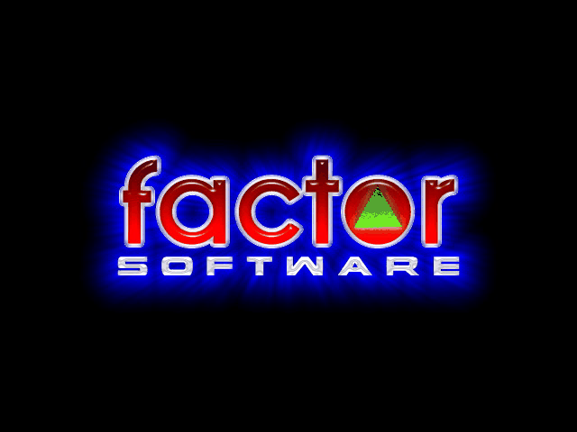

# BoomGame



Re-implementation of BOOM game (old macintosh game) with python & pygame.

[BOOM](https://www.macintoshrepository.org/3582-boom) was created by Federico Filipponi (FactorSoftware) in the ’90s. It is an arcade game that can be played by up to two player on a single computer. Players are facing an alien invasion in 80 levels. Their goal is to elimitate all the aliens with their bombs.

The game is not supported any more and can be played only on macos X (> 10 years old). This is a fan remake of BOOM in python using pygame library. This implementation can run on any os/laptop that support python3 and pygame. **NOTE: The original BOOM assets belong to Factor Software. We do not hold any intellectual property upon them.** We only provide standalone executable for a few modern plateform. You may have to install python and install from pypi to run BOOM on your specific platform.

This work is still in development. A more mature remake of the game in C++ is available in the [Lifish](https://github.com/silverweed/lifish) project.

## Install
### Download standalone or package

We provide BOOM standalones for each os in [github releases](https://github.com/raphaelreme/boomgame/releases). **NOTE: The standalone are built only for platform provided by github runners.**

Try to download the executable that matches your platform (or the closest to it) and the game should run! (More details below)

#### Linux
We provide a BOOM-ubuntu-$VERSION standalone that should work on matching ubuntu distributions (but hopefully on more linux ones, provided some default libs are here). Download the file, then make it executable (in a terminal):
```bash
$ chmod +x BOOM-ubuntu-20.04  # May requires sudo rights
```

Launch the game by double clicking on the file or using a terminal:
```bash
$ ./BOOM-ubuntu-20.04
```

We also provide a .deb package that wraps this standalone and install it correctly on your os. (This should work on matching ubuntu distribution and hopefull on other debians ones). Download the package (boom-$VERSION-1_all.$BUILDOS.deb), then install it using your package manager:
```bash
$ apt install ./boom*.deb  # Requires sudo rights
$ # OR
$ dpkg -i ./boom*.deb  # Requires sudo rights
```

Then BOOM can be found in the search bar of you OS, and launched from there.

#### MacOS
We provide a BOOM-macos-$VERSION.app standalone that should work on updated macos 11 and 12. (We are limited by github runners and have not worked yet to build the app on more diverse os). MacOs will probably stop you from executing the app (as it is not registered and correctly packaged regarding macos standards). To be able to run it, you have to overwrite macos warnings. **This is not a good practice and advise against it in general**, sadly this currently is our solution before working on macos packaging.

You also may have to make the file executable (in a terminal):
```bash
$ chmod +x BOOM-macos-11  # May requires sudo rights
```

#### Windows
We provide a BOOM-windows-$VERSION.exe standalone that should work on recent windows. Windows will probably stop you from downloading this executable (as we did not signed it, nor packaged it correctly yet), because it is dangerous to download random executable from the internet. To be able to download it and run it, you should overwrite windows warnings. **This is not a good practice and advise against it in general**, sadly this currently is our solution before working on windows packaging.


### From pypi
It requires to install python and pip first.

To install the the game (will also install pygame), you can run:

```
$ pip install boomgame
```

Once installed, the game can be launched with

```
$ boom
```

### Build from source
Download the source code. (+ Install python, pip and set up python environment)

Run:

```
$ pip install -r requirements-dev.txt
```

Again, the game can be launched with

```
$ boom
```

You can now build the standalone on your platform, following:

```bash
$ cd deploy/$MY_OS/
$ pyinstaller BOOM.spec  # Build the BOOM.exe / BOOM.app / BOOM standalone in the dist/ folder
```

For linux, we also provide a way to build the .deb package with the `build.sh` script:
```bash
$ bash build.sh  # Will run pyinstaller and packaged the result in a .deb
```

## Story
It’s happened again. The Earth is facing a new alien threat and who’s called to save our beloved planet? You guessed!

The aliens have the capability of transform themselves in all sort of deadly creatures. Basically, they act like parasites, attacking humans, animals and even machines and turning them into lethal killers.

Your mission is to penetrate 8 alien infested areas, each one divided in 10 sub-zones, eliminate all enemies using your bombs and finally kick the Big Alien Boss back to where he came from.

## BUGS and missing features

* The final boss is not yet integrated into the game
* The menu is still in beta and the player's controls cannot be changed yet
* Enemies can sometimes be stuck against one another (specially in timeout mode)


## Old BOOM Credits

The game [BOOM](https://www.macintoshrepository.org/3582-boom) has been created by Federico Filipponi.
Copyright 1997-2011 Factor Software. All Rights Reserved.

The sounds and music of BOOM have been created by George E. Kouba, Jr. and are copyrighted by Wizid Multimedia. Used with permission.

BOOM makes use of MGGame, an OpenGL/OpenAL based library suitable for developing 2D games for Mac OS X and iOS (iPhone, iPod Touch, iPad).
MGGame is Copyright © by Sebastian Wegner.
Sebastian is also leading McSebi Software, a team of independent game developers devoted to create fun shareware video games for the Mac and Apple mobiles.

The loading screen artwork has been made by Raymond Zachariasse, a web designer and freelance graphic artist, leader of the Quality Team.

BOOM also makes use of the Tempesta Seven Fonts by Yusuke Kamiyamane.
